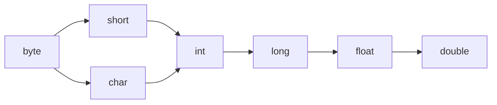

### 变量

**JAVA中的8基本变量类型**

1. 整型 (4种)
2. 字符型(1种)
3. 浮点型(1种)
4. 布尔型(1种)

一个变量的类型 决定了该变量可以包含什么样的值, 这8种基本类型都是Java语言预先定义好的


**整型**

> 整型变量用于存放整数
>
> byte	short	int	long 区别在于不同类型的整型,最大值.最小值不一样
>
> 如果试图给byte类型的变量赋于超出其范围的值,就会产生编译错误,  ==tips:可以进行类型转换==


==***整型数据类型***==

| 类型  | 长度 |                           数值范围                           |
| :---: | :--: | :----------------------------------------------------------: |
| byte  | 8位  | 取值范围为-128~127，占用**1个字节**（-2的7次方到2的7次方-1） |
| short | 16位 | 取值范围为-32768~32767，占用**2个字节**（-2的15次方到2的15次方-1） |
|  int  | 32位 | 取值范围为（-2147483648~2147483647），占用**4个字节**（-2的31次方到2的31次方-1） |
| long  | 64位 | 取值范围为（-9223372036854774808~9223372036854774807），占用**8个字节**（-2的63次方到2的63次方-1） |

```java
public class HelloWorld {
    public static void main(String[] args) {
        byte b = 1;
        short s = 200;
        int i = 300;
        long l = 400;
        
        /* 如果试图给byte类型的变量赋于超出其范围的值,就会产生编译错误 */
        byte b2 = 128; //报错
    }
}
```


**字符型**

> char类型用于存放一个字符,值用单引号'表示(双引号表示字符串)
>
> 其长度和short一样,也是16位
>
> 只能存放一个字符,超过一个字符就会产生编译错误

```Java
public class HelloWorld {
    public static void main(String[] args) {
        char c = '中';
        
        // char 只能存放一个字符,超过一个字符就会产生编译错误
        char c2 = '中国';	//报错
        char c3 = 'ab';	//报错
    }
}
```


**浮点型**

> 浮点数类型有两种
>
> float 长度为 32位; double 长度为 64位
>
> ==Tips: 默认的小数值是double类型的==
>
> 所以 float f = 54.321会出现编译错误,因为54.321的默认类型是double,其类型长度为64,超过了float的长度32
>
> 在数字后面加一个字母f,直接把该数字声明成float类型 float f2 = 54.321 f, 这样就不会报错了


==***浮点型数据类型***==

|  类型  | 长度 |                           数值范围                           |
| :----: | :--: | :----------------------------------------------------------: |
| float  | 32位 | 数据范围在3.4E-038 ~ 3.4E+038，直接赋值时必须在数字后加上f或F。 |
| double | 64位 | 数据范围在1.7E-308 ~ 1.7E+308，赋值时可以加d或D也可以不加。  |

```Java
public class HelloWorld {
    public static void main(String[] args) {
        double d = 123.45;
        
        //该行会出现编译错误,因为54.321是double型的
        float f = 54.321;
        float f2 = 54.321f;
    }
}
```


**布尔型**

> 布尔型用于表示真假
>
> 其==长度为1==
>
> boolean b1 = true;
>
> Boolean b2 = false;
>
> 分别表示真和假; 虽然布尔型真正存放的数据是0(false) 1(true),但是 不能直接使用 0 1 进行赋值

```java
public class HelloWorld {
    public static void main(String[] args) {
        boolean b1 = true;
        boolean b2 = false;
        
        //虽然布尔型真正存放的数据是0(false) 1(true) 但是不能直接使用 0 1 进行赋值
        boolean b3 = 1;
    }
}
```


**String类型**

> String类型其实==并不是基本类型==,但是它是如此广泛的被使用.常常被误以为是一种基本类型.
>
> ==String类型是Immutable的,一旦创建就不能够被改变==

```java
public class HelloWorld {
    public static void main(String[] args) {
        String str = "Hello Java";
    }
}
```


**整数字面值**

> 默认 int类型
>
> 当以l或者L结尾的时候,一个整数字面值是long类型, 建议使用大写的L,小写l容易和1混淆
>
> byte,short,int和long的值都可以通过int类型的字面值来创建.
>
> 十进制: 基 10, 包含从0-9的数字, ==平常用的就是十进制==
>
> 十六进制: 基 16, 包含从0-9的数字,和从A-F的字母
>
> 八进制: 基 8, 包含从0-7的数字
>
> 二进制: 基 2, 包含0和1, (从JAVA7开始就可以创建 二进制的字面值)

```java
public class HelloWorld {
    public static void main(String[] args) {
        long val = 26L;	//以L结尾的字面值表示long
        int decVal = 26;	//默认就是int型
        int hexVal = 0x1a;	//16进制
        int oxVal = 032;	//8进制
        int binVal = 0b11010;	//2进制
        System.out.println(oxVal);
    }
}
```


**浮点数字面值**

> 默认 double类型
>
> 当以f或者F结尾的时候, 就表示一个float类型的浮点数,
>
> 浮点数还可以用E或者e表示(科学计数法)
>
> e2表示10的二次方, 即100
>
> 1.234e2 = 1.234x100

```java
public class HelloWorld {
    public static void main(String[] args) {
        float f1 = 123.4F;	//以F结尾的字面值表示float
        double d1 = 123.4;	//默认就是double类型
        double d2 = 1.234e2;	//科学计数法表示double
    }
}
```


**字符和字符串字面值**

> 字符的字面值放在单引号中
>
> 字符串的字面值放在双引号中
>
> 需要注意的是, \表示转义.比如需要表示制表符,回车换行,双引号等就需要用 \t \r \n \\" 的方式进行

```java
public class HelloWorld {
    public static void main(String[] args) {
        String name = "SF";
        char a = 'c';
        
        //以下是转义符
        char tab = '\t';	//制表符
        char carriageReturn = '\r';	//回车
        char newLine = '\n';	//换行
        char doubleQuote = '\"';	//双引号
        char singleQuote = '\'';	//单引号
        char backslash = '\\';	//反斜杠
    }
}
```


**类型之间的数据转换**


> ==精度高==的数据类型就像==容器大==的杯子,可以==放更大==的数据
>
> ==精度低==的数据类型就像==容器小==的杯子,只能==放更小==的数据
>
> 小杯子往大杯子里倒东西,大杯子==怎么都能放得下==
>
> 大杯子往小杯子里倒东西,==有的时候放得下,有得时候就会有溢出==
>
> 需要注意的一点是
>
> 虽然short和char都是16位,长度是一样的 但是彼此之间,仍然需要进行强制转换


==***数据类型转换***==

规则: 从小到大自动转,从大到小强制转.



char 和short 强制转换

```java
public class HelloWorld {
    public static void main(String[] args) {
        char c = 'A';
        short s = 80;
        
        //虽然short和char都是16位的,长度是一样的
        //但是彼此之间 仍然需要进行强制转换
        c = (char) s;
        //直接进行转换. 会出现编译错误
        s = c;
    }
}
```

***低精度向高精度转换***

> l 是long类型的, 其类型长度是64位
>
> i 是int类型的, 其类型长度为32为
>
> 所以l的精度 比 i的精度高
>
> l = i
>
> 把i的值赋值给l, 首先l和i彼此的类型是不一样的, 那么能否转换就取决于彼此的精度
>
> 低精度向高精度转换是可以正常转换的 换句话说 int比较小 妖放进比较大的long 随便怎么样都放的进

```java
public class HelloWorld {
    public static void main(String[] args) {
        long l = 50;
        int i = 50;
        
        // int比较小,要放进比较大的long 随便怎么样都放的进
        l = i;
    }
}
```


***高精度向低精度转换***

>b的类型是byte，其长度为8, ==最大只能放127==
>
>I1 的类型是int, 其长度是32, 最大能放...  超过127
>
>所有, 把int类型的数据转成为byte类型的数据, ==是有风险的==
>
>==有的时候是可以转换的==, 比如 b = i1 (i1=10);
>
>==有的时候不可以转换== 比如b = i2 (i2=300) 因为放不下了编译器就会提示错误
>
>这个时候就只能采用==强制转换==, 强制转换的意思就是 转是可以转的 但是不对转换之后的值负责 风险自担

```java
public class HelloWorld {
    public static void main(String[] args) {
        byte b 5;
        int i1 = 10;
        int i2 = 300;
        
        b = (byte) i1;
        //因为i1的值是在byte范围之内，所以即便进行强制转换 最后得到的值也是10
        System.out.println(b);
        
        //因为i2的值是在byre范围之外 所以就会按照byte的长度进行截取
        //i2的值是300 其对应的二进制数是100101100
        //按照byte的长度8位进行截取后 其值为 00101100 即44
        b = (byte) i2;
        System.out.println(b);
        
        //查看一个整数对应的二进制的方法:
        System.out.println(Integer.toBinaryString(i2));
    }
}
```


**变量命名规则**

> 变量命名只能使用字母 数字 $ _
>
> 变量第一个字符 只能使用 字母 $ _ 变量第一个字符不能使用数字
>
> 在命名的时候,尽量使用完整的单词进行命名,而非缩写
>
> 不能只使用关键字,但是可以包含关键字
>
> 例如: int class = 5;  class是关键字 但是可以包含数字 例如: int class5= 5;
>
> 中文也可以用来命名变量 但是在实际工作中 ==别这么干==


**变量的作用域**

> 当一个变量被声明在类下面
>
> 变量就叫做==字段==或者==属性==、==成员变量==、==Field==
>
> 比如变量i,就是一个属性,那么从第二行这个变量声明的位置开始,整个类都可以访问得到
>
> 所以其作用域就是从其声明的位置开始的整个类

```java
public class HelloWorld {
    int i = 1;
    int j = i; //其他的属性可以访问i
    public void method1() {
        System.out.println(i); //方法1里可以访问i
    }
    public void method2() {
        System.out.println(i); //方法2里可以访问i
    }
}
```

> 如果一个变量,是声明在一个方法上的,就叫做==参数==
>
> 参数的作用域即为该方法内的所有代码
>
> 其他方法不能访问 该参数, 类里面页不能访问该参数

```java
public class HelloWorld {
    public void method1(int i) { //参数i的作用域即方法method1
        System.out.println(i);
    }
    public void method2() {
        System.out.println(i); //method2不能访问参数i
    }
    int j = i; //类里面也不能访问参数i
}
```

> 声明在方法内的变量,叫做==局部变量==
>
> 其作用域在声明开始的位置,到其所处于的快结束位置

```java
public class HelloWorld {

    public void method() {
        int i = 5; //其作用范围是从声明的第4行,到其所处于的块结束位置12行
        System.out.println(i);
        {	//子块
            System.out.println(i); //可以访问i
            int j = 6;
            System.out.println(j); //可以访问j
        }
        System.out.println(j); //不能访问j,因为其作用域到10行就结束了
    }
}
```

